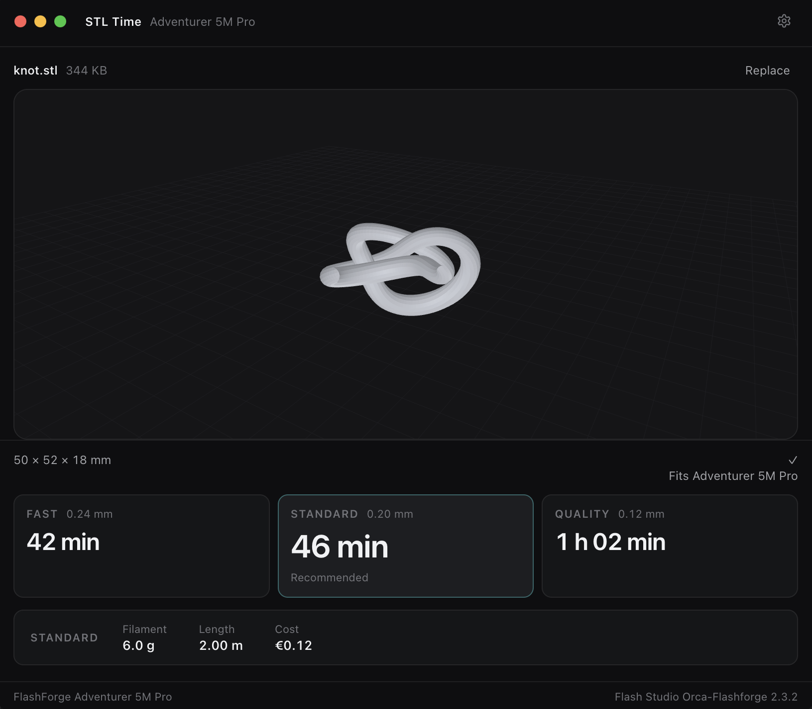

# STL Time

[](https://github.com/ipaud/stl-time/actions/workflows/ci.yml)
[](LICENSE)
[](#requirements)

A small macOS utility that answers one question:

> **How long will this take to print on my FlashForge Adventurer 5M Pro?**

Drop an STL, see the model, get three print times. That is the whole product.



It is not a slicer. There is nothing to configure, no accounts, no network. Every
STL you open stays on your machine.

When OrcaSlicer (or FlashForge's own fork of it) is installed, the numbers come
from a real slice with FlashForge's official Adventurer 5M Pro presets, so they
match what you would see in the slicer itself. When it is not, the app falls back
to an estimate of its own and says so, with a `≈` and an **Approximate** label.

## Download

Grab the latest `.dmg` from [Releases](https://github.com/ipaud/stl-time/releases).

The build is **unsigned**, so macOS will refuse to open it the first time:
right-click the app and choose **Open**, then confirm. Or
[build it yourself](#getting-started) — it takes one command.

---

## Requirements

- macOS on Apple Silicon (developed and verified on macOS 26.5, arm64)
- Node 20+ and [pnpm](https://pnpm.io)
- Optional but strongly recommended: **OrcaSlicer**, or FlashForge's official
  fork of it, **Flash Studio** / **Orca-Flashforge**

Without a slicer installed the app still works — it falls back to an
approximate model and says so plainly.

## Getting started

```bash
pnpm install
pnpm dev          # runs the app with hot reload
```

Production:

```bash
pnpm build        # typecheck + tests + bundle to out/
pnpm dist         # bundle and package dist/STL Time-<version>-arm64.dmg
```

Two sample models are included so you can try it straight away:

```
samples/knot.stl        50 × 52 × 18 mm, fits the bed
samples/too-large.stl   251 × 260 × 92 mm, does not
```

Other scripts:

```bash
pnpm lint
pnpm typecheck
pnpm test
```

---

## How the slicer integration works

STL Time never ships or bundles a slicer. It looks for one you already have,
drives its command line, and reads the G-code it produces.

### Where it looks

In this order, under both `/Applications` and `~/Applications`:

```
Flash Studio.app            ← FlashForge's official OrcaSlicer fork
Orca-Flashforge.app
OrcaSlicer.app
OrcaSlicer-Flashforge.app
```

For each candidate it reads `CFBundleExecutable` from the bundle's `Info.plist`
rather than guessing the binary name — FlashForge's build installs as
`Flash Studio.app` with an executable literally called `Flash Studio`. It then
checks the binary is executable and runs `--help` to read the version.

### Where the printer presets come from

The app uses FlashForge's **official** presets, never invented ones. It prefers
the copy inside the app bundle and falls back to your user profile directory:

```
<bundle>/Contents/Resources/profiles/Flashforge/
~/Library/Application Support/Orca-Flashforge/system/Flashforge/
~/Library/Application Support/OrcaSlicer/system/Flashforge/
```

A directory only counts as usable if it actually contains all four presets the
app needs. If none does, the app treats the slicer as unavailable and uses the
approximate estimate rather than slicing with the wrong profile.

| Role     | Preset                                                 |
| -------- | ------------------------------------------------------ |
| Machine  | `Flashforge Adventurer 5M Pro 0.4 Nozzle.json`         |
| Filament | `Flashforge Generic PLA.json`                          |
| Fast     | `0.24mm Draft @Flashforge AD5M Pro 0.4 Nozzle.json`    |
| Standard | `0.20mm Standard @Flashforge AD5M Pro 0.4 Nozzle.json` |
| Quality  | `0.12mm Fine @Flashforge AD5M Pro 0.4 Nozzle.json`     |

These are the only three process presets FlashForge publishes for the 0.4 mm
nozzle. **Nothing is overridden** — no walls, no shells, no infill, no speeds,
no temperatures — so the times you see are the times Flash Studio itself would
give you for the same model. The single exception is `--filament-density`,
explained below.

### The command

```
<slicer binary>
  --load-settings   "<machine>.json;<process>.json"
  --load-filaments  "<filament>.json"
  --filament-density 1.24
  --ensure-on-bed
  --arrange 1
  --orient  0
  --slice   0
  --outputdir <temp job dir>/<preset>
  <your file>.stl
```

Arguments are always passed as an array to `spawn`; nothing is ever
interpolated into a shell string.

Three behaviours of this CLI are worth knowing, all found by testing it rather
than by reading docs:

- **It exits with status 0 even when it fails.** A failed run prints
  `run found error, exit` and returns 0, so the app judges success only by
  whether a `plate_1.gcode` actually appeared.
- **`--outputdir` must already exist.** It will not create the directory and
  fails with `the parent path ... is not there, create it!`
- **`--arrange 0` does not move the model.** An STL authored away from the
  origin then lands outside the 220 × 220 bed and is rejected even though it
  fits. `--arrange 1` places it on the bed and changes the estimate by well
  under 1%. Orientation is never touched.

### Reading the result

The app reads only the first 64 KB of the G-code — everything it needs is in
the header — and parses it tolerantly:

```
; estimated printing time (normal mode) = 45m 36s
; filament used [mm]  = 1996.08
; filament used [cm3] = 4.80
; total filament used [g] = 5.95
```

FlashForge's PLA preset ships `filament_density = 0`, which makes the slicer
report **0 g** of filament. The app passes `--filament-density 1.24` so the
weight comes out correctly, and if a weight is still missing or zero it derives
it from the extruded volume instead.

### Temporary files

Everything lands in `$TMPDIR/stl-time/job-<uuid>/<preset>/`. **Your STL is never
copied or modified** — its original path is handed straight to the slicer. Job
directories are removed when a job is replaced or when the app quits, and the
whole `stl-time` directory is wiped at startup (a single-instance lock
guarantees no other copy is mid-job).

---

## How the approximate estimate works

When no slicer is installed — or when a slice fails — the app falls back to a
model of its own. It never pretends this is precise: the times are prefixed
`≈`, labelled **Approximate**, and rounded to whole minutes (5-minute steps past
an hour).

The model is:

```
extruded  = surfaceArea × shellThickness + interiorVolume × infillFraction
path      = extruded / (lineWidth × layerHeight)
seconds   = path / speed + layerCount × layerOverhead
```

Its constants were fitted against **real slices** made with the official
FlashForge presets, across five deliberately different shapes — a 20 mm cube, a
100 mm cube, a thin torus knot, a 20 × 20 × 150 tower and a 120 × 120 × 3 plate
— for all three presets. The fit minimises the _worst_ relative error rather
than nailing any one shape.

**Accuracy: within about ±35% across those five shapes.** It is a sanity check,
not a substitute for slicing. Thin, curved geometry is where it is weakest: it
underestimates, because it cannot see that short curved perimeters never reach
full speed. The calibration points are pinned in
`src/main/slicer/fallback.test.ts`, so changing a constant without re-measuring
breaks the suite.

---

## Architecture

```
src/
├── main/                    Electron main process — the only place with disk
│   ├── index.ts             lifecycle, single-instance lock, quit cleanup
│   ├── window.ts            the one window
│   ├── menu.ts              ⌘O, ⌘, and ⌘W
│   ├── ipc.ts               handlers; validates everything from the renderer
│   ├── settings.ts          PLA price, one JSON file in userData
│   ├── temp.ts              job directories and their cleanup
│   ├── gcode/parse.ts       tolerant G-code header parser
│   └── slicer/
│       ├── engine.ts        the SlicerEngine interface
│       ├── detect.ts        finds an installed slicer and its presets
│       ├── orca.ts          OrcaSlicerEngine — spawns the CLI
│       ├── fallback.ts      FallbackEstimator — the approximate model
│       └── jobs.ts          job ids, sequential runs, cancellation
├── preload/index.ts         the entire renderer-facing API surface
├── shared/                  types and pure logic used by both sides
│   ├── ipc.ts               channel names and the typed contract
│   ├── printers/            the Adventurer 5M Pro profile
│   ├── profiles/quality.ts  Fast / Standard / Quality
│   └── utils/               time, cost and fit formatting and maths
└── renderer/                React UI
    ├── state.ts             one reducer, no state library
    ├── lib/stl.ts           STLLoader, dimensions, volume, surface area
    └── components/
```

### Security

- `contextIsolation: true`, `nodeIntegration: false`, `sandbox: true`
- The renderer gets a handful of functions on `window.stlTime` and nothing else:
  no `fs`, no `child_process`, no `ipcRenderer`
- A dropped file becomes a path only inside the preload, via
  `webUtils.getPathForFile`
- Every path from the renderer is re-checked in main: it must end in `.stl` and
  be a real file before it goes anywhere near `spawn`
- The saved PLA price is clamped on the way in
- A CSP in `index.html` restricts the page to its own origin; the app makes no
  network requests at all

### Performance

The STL is parsed **once**, in the renderer, and that single pass feeds the 3D
viewer, the dimensions, the fit check and the fallback estimator. Only the file
path crosses IPC for slicing — never the model bytes. The three presets are
sliced sequentially in the main process, so the UI never blocks and results
appear as each one lands.

---

## MVP limitations

Deliberately out of scope for this version:

- **One printer.** FlashForge Adventurer 5M Pro, 0.4 mm nozzle.
- **One material.** PLA at 1.24 g/cm³. The types are shaped for PETG and others
  but no selector is exposed.
- **One format.** `.stl` only — no 3MF, OBJ or STEP.
- **No orientation help.** The model is sliced exactly as authored (dropped onto
  the bed on Z). No optimal-orientation search, and the fit check does not try
  rotating a model that does not fit.
- **No supports.** Whatever the FlashForge preset does by default is what you
  get; there is no support editing or painting.
- **Single plate, single object.**
- **The build is unsigned.** `identity: null` in `electron-builder.yml`, so
  macOS Gatekeeper will complain on first launch until you sign it.

---

## Troubleshooting

**"Using approximate estimate. Install OrcaSlicer for more accurate results."**
No slicer was found, or the one found has no Adventurer 5M Pro presets. Install
OrcaSlicer or FlashForge's Flash Studio into `/Applications`. Run the app from a
terminal to see what detection did:

```bash
pnpm dev
# [slicer] detected /Applications/Flash Studio.app/Contents/MacOS/Flash Studio
# [slicer] version Orca-Flashforge 2.3.2
# [slicer] profiles /Applications/Flash Studio.app/Contents/Resources/profiles/Flashforge
```

**"Couldn't slice this model. Showing an approximate estimate instead."**
The slicer ran but produced no G-code. The usual cause is geometry it rejects —
non-manifold meshes, zero-volume shells. The reason is printed in the terminal.

**"This file doesn't look like a valid STL."**
The file could not be parsed as binary or ASCII STL, or it contains no
triangles. Note that a synthetic STL whose bytes happen to all be printable
ASCII can be misread as an ASCII STL by the slicer; real exports are not
affected.

**To force the fallback path** (useful when working on it):

```bash
STL_TIME_NO_SLICER=1 pnpm dev
```

**`Cannot read properties of undefined (reading 'setName')` on `pnpm dev`**
`ELECTRON_RUN_AS_NODE=1` is set in your shell, which makes Electron start as
plain Node. Some editors and terminals set it. Run:

```bash
env -u ELECTRON_RUN_AS_NODE pnpm dev
```

**Gatekeeper blocks the packaged app.** The build is unsigned. Right-click the
app and choose Open, or sign it with your own Developer ID.

---

## Contributing

Issues and pull requests are welcome. Please read
[CONTRIBUTING.md](CONTRIBUTING.md) first — it explains what is deliberately out
of scope, and why the slicer presets and the fallback constants must not be
changed without real measurements.

Security issues: see [SECURITY.md](SECURITY.md). Please do not open a public
issue for those.

## License

[MIT](LICENSE) © Pau Avila

Sample models in [`samples/`](samples/) are procedurally generated and in the
public domain. STL Time bundles no slicer and no vendor presets: it reads the
presets from the copy of OrcaSlicer or Flash Studio you installed yourself.
